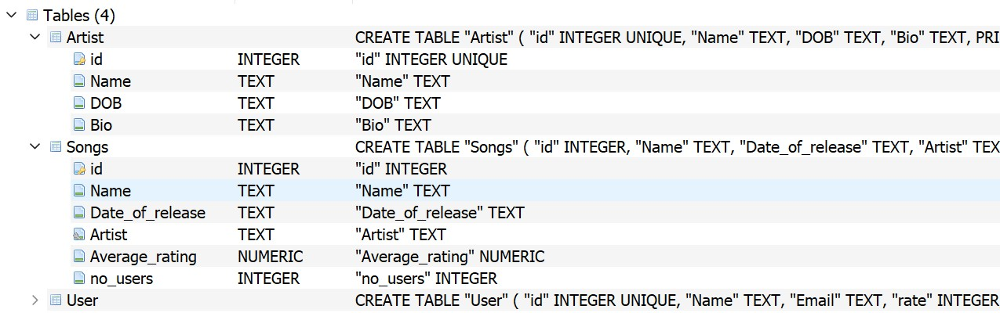
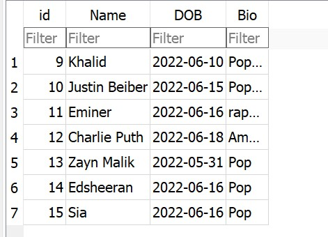
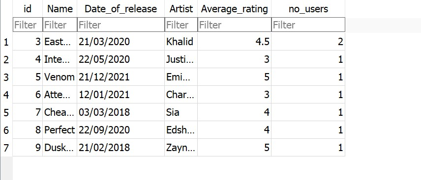
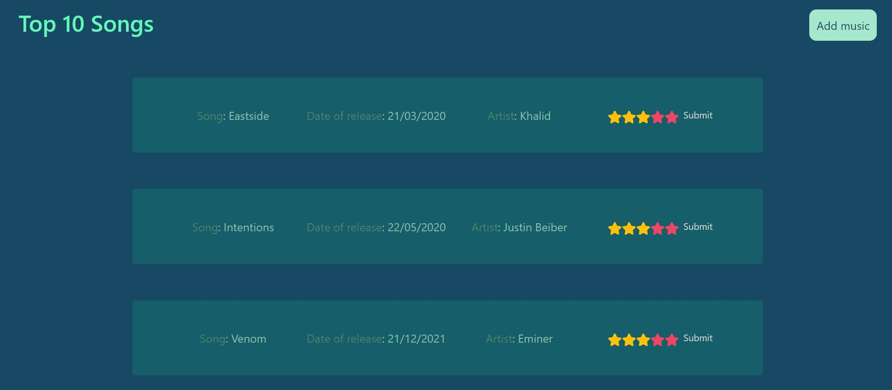
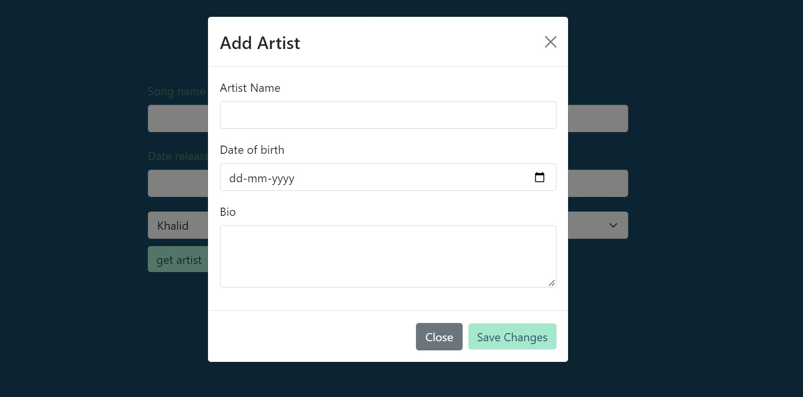

# spotify-model
This a CRUD spotify model app created using ReactJS, Express and Sqlite as Database. 

### Pre-requisites

1. Install `node` on your device if not already by looking up the following docs (https://nodejs.org/en/download/)(https://www.python.org/downloads/mac-osx/)

---
#### Setup 

###### clone the repository
``
git clone  https://github.com/neeraj2403/spotify-model.git
``
###### move to the cloned Directory

#### Database Design

The database contains 3 table one for the storing details of songs, one for details artist and other one for details of the user. 

#### Website Snippets

